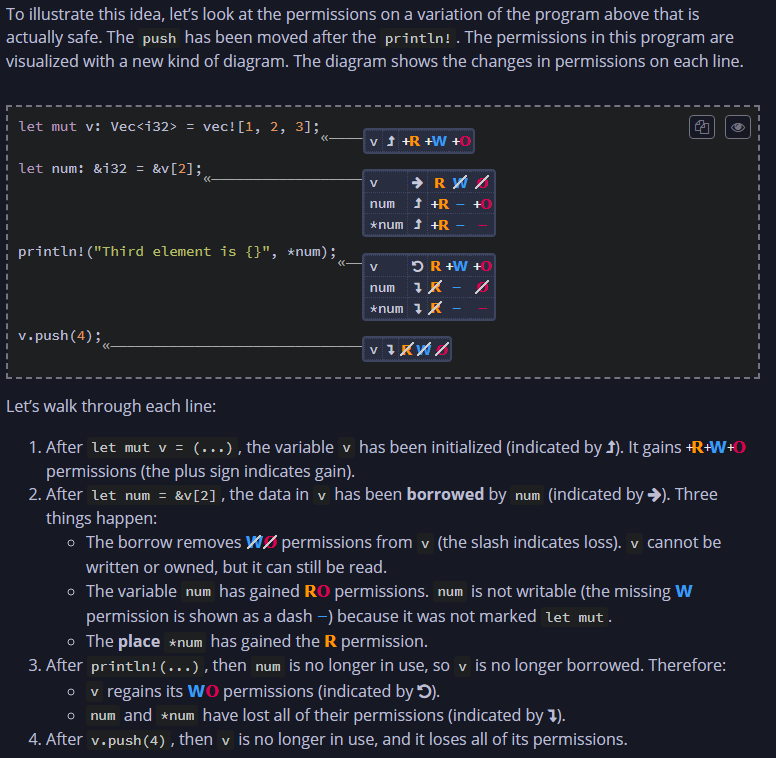
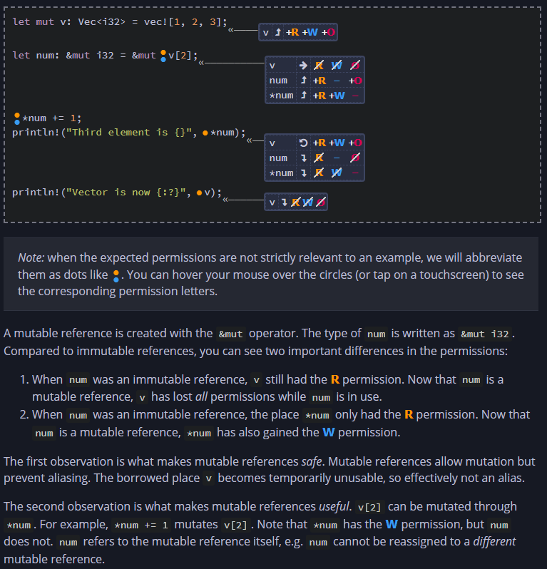

# Ownership

### Concept

- A discipline that ensures **safety** of Rust programs
- Rust’s goal is to compile programs into efficient binaries that require as few runtime checks as possible, hence the rules of ownership
- Ownership rules avoid scenarios like accessing a variable before it is defined (the scenarios where the resultant behavior of the program is unreliable)
- Ownership is a model of thinking about _memory_, which is not too high level (like "memory is a thing that holds my data") and not too low level (like "memory is a location in my physical RAM which I get after using `malloc`")
- Variables live in "stack" and Boxes live in "heap"

  ```rust
  // Variable a contains an array of 1 million values
  // and it is copied in the second line
  let a = [0; 1_000_000];
  let b = a;

  // Here Box is used to contain the same values
  // and now b = a does not copy the data since it lives in heap
  // a in this case is pointer
  let a = Box::new([0; 1_000_000]);
  let b = a;
  ```

- Rust **does not** have `free` to manually deallocate memory from heap
- How Rust decides to deallocate a `Box`?

  - When a `Box` is allocated to a variable, that variable (pointer) is said to **own** the box
  - e.g.

    ```rust
    let a = Box::new(5);
    let b = a
    ```

  - It is incorrect to free the `Box` referenced by `a` and `b` both when the go out of scope, because `free` should be happening only once (since there's only 1 box)
  - Hence it is said that "Box's ownership is moved from a to b" in above snippet
  - If a variable owns a box, when Rust deallocates the variable’s frame, then Rust deallocates the box’s heap memory
  - In above snippet, if the programmer tries to access the box through `a`, Rust borrow checker gives error saying the ownership has moved
  - At any given point of time, there's only one variable that "owns" the data

- Rust data structures like `Vec`, `String` and `HashMap` use `Box`s underneath

##### A little more involving example

```rust
fn main() {
  let first = String::from("Ferris"); // L1
  let full = add_suffix(first); // L4
  println!("{full}");
}

fn add_suffix(mut name: String) -> String {
  /* L2 */ name.push_str(" Jr."); // L3
  name
}
```

- At L1, the string “Ferris” has been allocated on the heap. It is owned by `first`.
- At L2, the function `add_suffix(first)` has been called. This moves ownership of the string from `first` to `name`. The string data is not copied, but the pointer to the data _is_ copied.
- At L3, the function `name.push_str(" Jr.")` resizes the string’s heap allocation. This does three things.
  - First, it creates a new larger allocation.
  - Second, it writes “Ferris Jr.” into the new allocation.
  - Third, it frees the original heap memory. `first` now points to deallocated memory.
- At L4, the frame for `add_suffix` is gone. This function returned `name`, transferring ownership of the string to `full`.

Rust borrow checker (BC) will throw error if we try to access `first` after calling `add_suffix`. This happens because `first` now points to deallocated i.e. invalid memory. It is ok for `first` to exist, it's just not ok to _use_ `first` in the program thereafter.

This is called **"Moved heap data principle"** - if a variable `x` moves ownership of heap data to another variable `y`, then `x` cannot be used after the move.

Cloning avoid moves.

- Following doesn't produce an error from BC

  ```rust
  fn main() {
    let first = String::from("Ferris");
    let first_clone = first.clone();
    let full = add_suffix(first_clone);
    println!("{full}, originally {first}"); // first still exists at this level
  }

  fn add_suffix(mut name: String) -> String {
    name.push_str(" Jr.");
    name
  }
  ```

### References and borrowing

- It is many times inconvenient to pass ownership of data to and from functions, just to keep Rust happy

  - Following program produces error

  ```rust
  fn main() {
    let m1 = String::from("Hello");
    let m2 = String::from("world");
    greet(m1, m2);
    let s = format!("{} {}", m1, m2); // Error: m1 and m2 are moved
  }

  fn greet(g1: String, g2: String) {
    println!("{} {}!", g1, g2);
  }
  ```

  - We can fix this by returning the ownership, like so

  ```rust
  fn main() {
    let m1 = String::from("Hello");
    let m2 = String::from("world");
    let (m1_again, m2_again) = greet(m1, m2); // Ownership returned, Rust is happy
    // let (m1, m2) = greet(m1, m2)     // Shadowing works too
    let s = format!("{} {}", m1_again, m2_again);
  }

  fn greet(g1: String, g2: String) -> (String, String) {
    println!("{} {}!", g1, g2);
    (g1, g2)
  }
  ```

  But this makes the program verbose.

- References and the concept of _borrowing_ comes in handy in such scenarios
- We can fix the above error-producing code, like so

  ```rust
  fn main() {
    let m1 = String::from("Hello");
    let m2 = String::from("world");
    greet(&m1, &m2); // Pass the reference, note the ampersands
    let s = format!("{} {}", m1, m2); // No error
  }

  fn greet(g1: &String, g2: &String) { // Signature says g1 and g2 are references, not pointers
    println!("{} {}!", g1, g2);
  }
  ```

- **References are non-owning pointers**
- While `m1` owns the data on the heap ("Hello"), `g1` doesn't own either `m1` or the data

##### Dereferencing

- `*` operator dereferences the pointer
  ```rust
  let mut x: Box<i32> = Box::new(1);
  let a: i32 = *x;    // *x reads the heap value, so a = 1
  *x += 1;            // *x modifies the heap value, so now x points to value 2
  ```
- If we pass reference to a reference, we need to double dereference to reach the value
  ```rust
  // ... above snippet
  let r1: &Box<i32> = &x    // r1 is a reference to x, which is a references itself
  let b: i32 = **r1         // Needs double dereferencing to reach the value through r1
  ```
- Rust implicitly inserts dereferences and references in certain cases, such as calling a method with the dot operator
- In the following snippet, how many dereferences would be needed to reach the value through y?

  ```rust
  let x = Box::new(0);
  let y = Box::new(&x);
  ```

  Answer: 3. `***y` is the correct expression. y has the type `Box<&Box<i32>>`. It is a heap pointer to a stack reference to a heap pointer. (mind-f&\*k)

##### Aliasing and Mutation

- Aliasing: accessing the same data through different variables
- Mutation: Changing the value of the data
- If aliasing and mutation is allowed at the same time, it is inherently unsafe
- Rust has a simple solution for this: **Pointer Safety Principle: data should never be aliased and mutated at the same time.**
- But References, since they don't own, require Rust to come up with different set of rules to enforce this principle. Because References are meant to temporarily create aliases.
- **Borrow Checker** ensures safety when References come into picture.

##### Read-Write-Own permissions, Places and References

- Things can have 3 permissions over data: R-W-O
- A variable has read/own permissions on a data here `let v = 5`
- A mutable variable has read/write/own permissions `let mut v = 10`
- References can temporarily remove these permissions
- Illustration with explanation

  

- Why `num` and `*num` both shown? Because accessing data through a reference is not the same as manipulating the reference itself
- If we have a mutable reference, it does not mean the **place** that is referred by it is mutable. It simply means, we can do following
  ```rust
  let x = 0;
  let y = 1;
  let mut my_ref = &x;
  my_ref = &y;      // This is not possible if my_ref is not mutable
  ```
- But even in the above example, the **place** `*my_ref` is still immutable (has only R permission)
- More generally, permissions are defined on places and not just variables. A place is anything you can put on the left-hand side of an assignment
- Rust BC uses **Pointer Safety Principle** to determine which borrows are safe and which are not.

  ```rust
  let mut v: Vec<i32> = vec![1, 2, 3];
  let num: &i32 = &v[1];      // immutable borrow
  v.push(4);                  // mutable borrow
  println!("Second element is {}", *num);   // immutable borrow is used here again, not allowed
  ```

  The real reason Rust BC doesn't pass above program because `num` cannot be safely invalidated by `push`, because it was used later.

- **Mutable references** provide unique and non-owning access to data
- Illustration with explanation

  

- Mutable references get "dowgraded" to immutable ones if aliasing happens. E.g.

  ```rust
  let mut v: Vec<i32> = vec![1, 2, 3];
  let num: &mut i32 = &mut v[2];      // num is a mutable reference here
  let num2: &i32 = & *num;            // aliasing with num2, hence num loses W permission
  *num += 1;                          // so W with num is not allowed
  println!("{} {}", *num, *num2)      // but R with num is allowed
  ```

##### Data must outlive all of its References

- Part of the pointer safety principle
- Flow permission, in addition to R-W-O permissions

  - To give a different mechanism to Rust for knowing the lifetime of references
  - To treat input/output references differently than the references within the function body
  - E.g. `s_ref` in following snippet, does not have appropriate Flow permission

    ```rust
    fn return_a_string() -> &String {
      let s = String::from("Hello");
      let s_ref = &s;
      s_ref
    }
    ```

    Above program is unsafe, because the reference `&s` will be invalidated when the function returns

- Flow permissions have more to do with Lifetimes, so we'll revisit them in chapter 10
